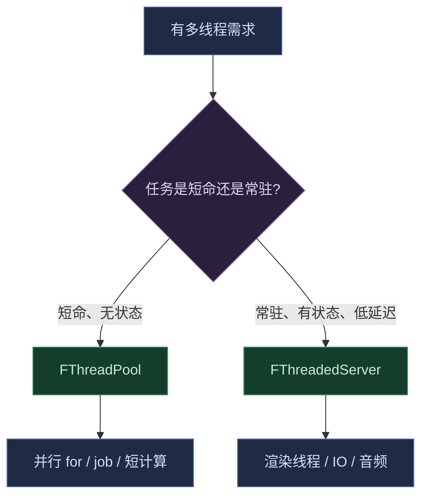

# Async — 并行模型

引擎的两种并行模型 + 一个可运行契约（`IRunable`）。选型原则：**瞬态任务进池，常驻角色用专用线程**。

## 两种模型

| | `FThreadPool` | `FThreadedServer` |
|---|---|---|
| 线程 | N 个常驻 worker | 1 个专用线程 |
| 模型 | 任务池（并行抢） | FIFO 串行队列 |
| barrier | `Run`（原子计数） | `Flush`（哨兵任务） |
| 用途 | 并行 for、短计算、job | 渲染线程、IO、音频 |

## 选型决策



## 用法

### FThreadPool — 瞬态并行任务

```cpp
FThreadPool Pool(4);                    // 0 = 硬件核数
Pool.Run(f1, f2, f3);                   // 并行执行 + barrier 等全部完成
Pool.Submit(task);                      // 提交一个 fire-and-forget 任务
```

### FThreadedServer — 专用常驻线程

```cpp
class FRenderThread : public FThreadedServer
{
	bool OnInitialize() override { /* 建 RHI 等 */ return true; }
	void OnShutdown() override { /* 清理 */ }
	const char* GetThreadName() const override { return "Render"; }
};

FRenderThread Render;
Render.Initialize();
Render.Submit(task);    // FIFO 入队（非阻塞）
Render.Flush();         // FIFO barrier
Render.Shutdown();      // 排空队列后 join
```

### IRunable — 可运行契约

凡有主循环的类型都实现它，app 侧统一驱动：

```cpp
class ICommandLine
{
	virtual ~ICommandLine() = default;
	virtual void ParseCommandLine(int Argc, char** Argv) = 0;
};

class IRunable : public ICommandLine
{
	virtual ~IRunable() = default;
	virtual void MainLoop() = 0;
};

// FEngineBase::MainLoop 在调用线程跑 app 主循环
// FThreadedServer::MainLoop 在专用线程跑 FIFO 队列循环
```

`ICommandLine` 让所有可运行对象（工具包 / 引擎）都能接收命令行参数；`MahoMain`/`MahoCLIMain` 创建后先 `ParseCommandLine` 再驱动。

## 关键语义

- **`Flush` 是 FIFO barrier**：哨兵任务排在队列尾，它之前提交的任务全部跑完才返回
- **`Shutdown` 排空队列**：已提交的任务执行完才退出，不丢任务
- **线程安全**：`Submit` 可从任意线程调用；任务在 worker 上并发执行，任务内共享数据需自带同步
- **`Run` 的优化**：0 个直接返回，1 个内联跑（不起线程）

## 相关文档

- [Async.h](Async.h) — 聚合头
- [ThreadPool.h](ThreadPool.h) — `FThreadPool`
- [ThreadedServer.h](ThreadedServer.h) — `FThreadedServer`
- [Runable.h](Runable.h) — `IRunable` 可运行契约
- [../TypeList.h](../TypeList.h) — `ForEach` + 调度器（并行遍历的消费方）
- [../Extension.h](../Extension.h) — 串行 / 并行调度器 + 并行扩展
- [../../Maho.md](../../Maho.md) — 引擎核心（`FEngineBase` / `FThreadedServer` 都是 `IRunable`）
