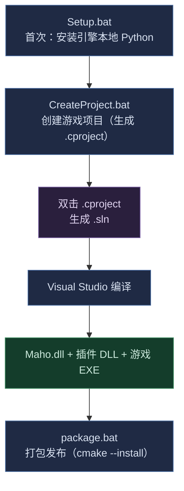

# Maho — UE 风格 C++ 游戏引擎脚手架

Maho 是一个极简引擎外壳：只提供每个游戏都需要的底层设施（应用生命周期、平台抽象、渲染硬件接口、扩展体系、插件机制）。游戏逻辑全部放在独立项目中，通过 `.cproject` 关联本引擎。

## 项目结构

```text
Maho/                           # 引擎仓库根
├── AGENTS.md                   # AI Agent 入口（第一站）
├── README.md                   # 本文件（面向人类）
├── Setup.bat                   # 首次：安装引擎本地 Python
├── CreateProject.bat           # 创建游戏项目
├── Maho/                       # 引擎本体
│   ├── CMakeLists.txt          # 引擎 DLL 入口（含插件扫描）
│   ├── Maho.cmake              # 核心三方库 FetchContent（nlohmann/glm）
│   ├── Source/
│   │   ├── Public/             # 对外接口 + 数据结构声明（Maho.h 聚合头）
│   │   │   ├── Maho.h          #   引擎聚合头
│   │   │   ├── EntryPoint.h    #   入口点
│   │   │   └── Core/           #   Engine / Misc / Server 子模块
│   │   ├── Private/            # 实现
│   │   └── Generated/          # 反射 / codegen 产物（gitignored）
│   ├── Plugins/                # 插件（自包含：.cplugin + .cmake + Public/Private + Content/）
│   │   ├── Platform/           #   窗口 + 输入（GLFW）
│   │   ├── Render/             #   RHI / RDG / Shader / UI（Vulkan + ImGui）
│   │   ├── Resource/           #   异步资源系统 + 包 IO
│   │   ├── Script/             #   Lua 脚本 VM（sol2 + Lua 5.4）
│   │   └── World/              #   ECS 世界 / SystemGroup
│   ├── Shaders/                # 引擎 shader
│   └── Content/                # 引擎内容（Fonts / Editor，VFS 挂载 /Engine）
├── Build/                      # CMake 入口 + 模块 + 项目模板
│   ├── CMakeLists.txt          #   引擎工作区入口（cmake -S Build）
│   ├── CMake/                  #   MahoDirectories / MahoHelpers / MahoDependencies
│   └── Templates/              #   GameProject 模板（Tools/create_project.py 用）
├── Tools/                      # 引擎工具链（引擎本地 Python）
├── Doc/                        # 工程配置（VS Code workspace）
└── 设计文档/                    # 游戏设计文档
```

## 构建流程



流程说明：

1. **`Setup.bat`**（首次/引擎换位置后）：安装引擎本地 Python 到 `%LOCALAPPDATA%\Maho\python\tooling\`，`Tools/python/` 是指向它的 junction。
2. **`CreateProject.bat`**：图形界面创建游戏项目，生成项目文件夹 + `.cproject`（记录 `EngineDirectory` 指向引擎）。
3. **双击 `.cproject`**：调用 CMake 生成项目 `.sln`。
4. **编译**：VS 打开 `.sln` 构建 —— 产出 `Maho.dll`、各插件 DLL、游戏 EXE。
5. **打包**：`package.bat`（`cmake --install`）收集运行时文件到 `Packaged/`。

缓存清理统一用 `git clean -dxf`（连 `Tools/python` 一起清，之后重跑 `Setup.bat`）。

## 文档指引

| 文档 | 作用 |
|------|------|
| [AGENTS.md](AGENTS.md) | AI Agent 入口 —— 代码设计约束、文档路径指引 |
| [Build/README.md](Build/README.md) | CMake 构建体系 + 项目模板 |
| [Tools/README.md](Tools/README.md) | 引擎工具链 |
| [Maho/Plugins/README.md](Maho/Plugins/README.md) | 插件总览 |
| `Maho/Plugins/<Name>/README.md` | 各插件引用 / 拓展指南（实现功能前先读） |
| `Maho/Source/Public/Maho.h` | 引擎聚合头（核心 public API 入口） |
| `设计文档/` | 游戏设计文档 |
