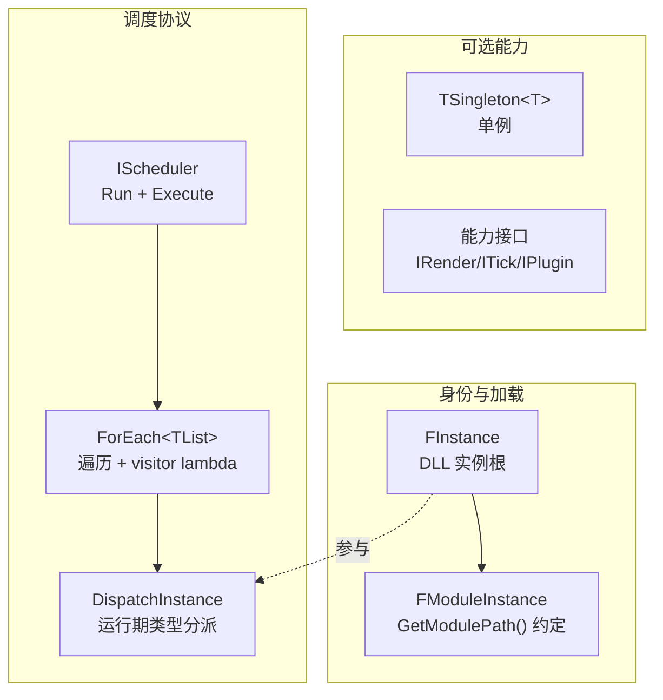

<!-- mahogen -->
# Core

## 代码文件

- [Assembly.h](Assembly.h)
- [Core.h](Core.h)
- [Delegate.h](Delegate.h)
- [Export.h](Export.h)
- [Extension.h](Extension.h)
- [Fatal.h](Fatal.h)
- [Interface.h](Interface.h)
- [Scheduler.h](Scheduler.h)
- [Singleton.h](Singleton.h)
- [Topology.h](Topology.h)
- [TypeList.h](TypeList.h)
<!-- mahogen end -->

## 概念——引擎基础设施

Maho 核心是**零 app 假设、零三方依赖、零 stage 预设**的纯积木。下面从"身份 → 能力 → 协议 → 列表"四层讲清每个概念。

### ① 根抽象与加载

**`FInstance`** —— 所有 DLL 内实例化的对象的根（只有一个虚析构）。刻意轻：唯一承诺是 `delete` 能走 DLL 自己的代码销毁整个对象。加载/符号查找是 `FAssembly` 的活，"它承诺什么"由派生接口声明。

**`FModuleInstance`** —— 模块实例约定：具体类型须提供 `static GetModulePath()`，指向载出它的 DLL。这样 `FModuleManager`（`Engine/ModuleManager.h`）能按类型加载该 DLL 并构造实例。

**`FAssembly`** —— DLL 加载单元（句柄的 RAII 独占封装，内部 `unique_ptr<void, deleter>`）。宿主必须让它的生命周期长于任何由它构造的实例——虚表/析构在 DLL 代码段里，先卸载就是用后释放。

### ② 能力（可选，各自独立）

| 概念 | 语义 | 与单例 |
|------|------|--------|
| `TSingleton<T>` | 进程内唯一实例（Meyers 单例，CRTP `Get()`） | — |
| 能力接口 | `FInstance` 派生的单个服务/阶段（`IRender`/`ITick`/`IPlugin<Caps...>`） | ✅ 兼容 |
| 模块 | 类型 +`GetModulePath()`+ DLL 导出 `CreateExtension()→FInstance*` | ❌ 互斥 |

身份是**独立可选能力**：工具要单例，模块要 "DLL + 工厂 + 实例驱动"，应用根就是一个模块。没有强加的生命周期——纯函数 DLL 无状态也不需要。要生命周期（init/shutdown/tick），类型明确继承对应能力接口，宿主才知道驱动它。

### ③ 调度协议

**`IScheduler`** —— 调度器契约：`Run`（驱动一组可调用）+ 双 `Execute`（并行遍历基座，编译期类型表 / 运行时实例数组）。

**`Execute<FTools>(visitor)`** —— 编译期版本：对每个工具类型 T，遍历器取 `T::Get()` 单例实例作为 `T&` 传给 visitor：

```cpp
Execute<FTools>([](T& Tool) {
	Tool.Initialize();
});
```

**`Execute(Instances, visitor)`** —— 运行时实例版本：对 `std::vector<FInstance*>` 内的每个实例并行调用 visitor（按运行期类型分派），宿主在 lambda 里把实例分派到该能力方法。

`Execute` 无 stage 语义——生命周期是宿主的职责：init/tick/shutdown 各调一次 Execute，各传一个 lambda 决定该阶段每个目标干什么。扩展只提供能力方法，不感知阶段。

### ④ 列表代数

`TTypeList` / `TCons` / `TAppend` / `TContains` / `TFilter<TList, TBase>`（按基类过滤，`is_base_of` 内联）/ `TFilterWhere<TList, TPredicate>`（按谓词过滤）/ `TCatch<TLists...>`（拼接多个 TTypeList）。

## 关系图



## 相关文档

- [Core.h](Core.h) — 聚合头
- [CoreAPI.html](CoreAPI.html) — API 文档
- [../Engine/EngineDoc.md](../Engine/EngineDoc.md) — 调度策略（Serial/Parallel/ThreadPool）与模块管理器
- [../../Private/Core/CoreDoc.md](../../Private/Core/CoreDoc.md) — 实现算法字典
- [../../SourceDoc.md](../../SourceDoc.md) — 源码根
