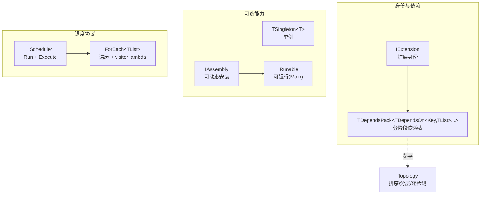

<!-- mahogen -->
# Core

## 代码文件

- [Assembly.h](Assembly.h)
- [Core.h](Core.h)
- [Delegate.h](Delegate.h)
- [Export.h](Export.h)
- [Extension.h](Extension.h)
- [Fatal.h](Fatal.h)
- [Runable.h](Runable.h)
- [Scheduler.h](Scheduler.h)
- [Singleton.h](Singleton.h)
- [Topology.h](Topology.h)
- [TypeList.h](TypeList.h)
<!-- mahogen end -->

## 概念——引擎基础设施

Maho 核心是**零 app 假设、零三方依赖、零 stage 预设**的纯积木。下面从"身份 → 能力 → 协议 → 列表"四层讲清每个概念。

### ① 扩展身份与依赖表

**`IExtension`** —— 所有扩展的根身份（只有一个虚析构）。

**依赖声明** —— 一个扩展就是"身份 + 依赖表"：继承 `IExtension`，定义 `using FDependsPack`。`TDependsPack` 持有若干 `TDependsOn<Key, TTypeList<...>>` slot，声明"在哪个阶段依赖谁"。

```cpp
class FInput : public Maho::IExtension
{
public:
    using FDependsPack = Maho::TDependsPack<Maho::TDependsOn<EStage::Init, TTypeList<>>>;
};

class FSystem : public Maho::IExtension
{
public:
    using FDependsPack = Maho::TDependsPack<
        Maho::TDependsOn<EStage::Init, TTypeList<FInput>>,      // Init 依赖 FInput
        Maho::TDependsOn<EStage::Tick, TTypeList<FInput>>>;     // Tick 也依赖
};
```

`TResolveDependsPack<T>::Type` 解析出 T 的 pack（无 `FDependsPack` 时为空 = 无依赖）；`Topo::TNodeDeps_t<T, Key>` 按 Key 取该阶段的依赖列表；`Topo::TIsAcyclic_v` / `TTopoSort_t` / `TLevels_t` 做排序、分层与环检测。

### ② 能力（可选，各自独立）

| 概念 | 语义 | 与单例 |
|------|------|--------|
| `TSingleton<T>` | 进程内唯一实例（Meyers 单例） | — |
| `IRunable` | 可运行（有 `Main`） | ✅ 兼容 |
| `IAssembly` | 可动态安装（`IRunable` + 导出 `CreateExtension`） | ❌ 互斥 |

`TSingleton` 和 `IRunable`/`IAssembly` 是**独立的可选能力**，插件自己决定要哪个：工具要单例、Layer 要 "Assembly（导出，实例驱动）"、应用根就是一个 Layer。

### ③ 调度协议

**`IScheduler`** —— 调度器契约：`Run`（驱动一组可调用）+ 双 `Execute`（并行遍历基座，编译期类型表 / 运行时实例数组）。

**`Execute<FTools>(visitor)`** —— 编译期版本：对每个工具类型 T，遍历器取 `T::Get()` 单例实例作为 `T&` 传给 visitor：

```cpp
Execute<FTools>([](T& Tool) {
	Tool.Initialize();
});
```

**`Execute(Layers, visitor)`** —— 运行时实例版本：对 `std::vector<IAssembly*>` 内的每个层实例并行调用 visitor，宿主在 lambda 里把实例分派到该层能力方法。

`Execute` 无 stage 语义——生命周期是宿主的职责：init/tick/shutdown 各调一次 Execute，各传一个 lambda 决定该阶段每个目标干什么。扩展只提供能力方法，不感知阶段。

### ④ 列表代数

`TTypeList` / `TCons` / `TAppend` / `TContains` / `TFilter<TList, TBase>`（按基类过滤，`is_base_of` 内联）/ `TFilterWhere<TList, TPredicate>`（按谓词过滤）/ `TCatch<TLists...>`（拼接多个 TTypeList）。

## 关系图



## 相关文档

- [Core.h](Core.h) — 聚合头
- [CoreAPI.html](CoreAPI.html) — API 文档
- [../Engine/EngineDoc.md](../Engine/EngineDoc.md) — 插件模板（Tool/Layer/Engine）
- [../../Private/Core/CoreDoc.md](../../Private/Core/CoreDoc.md) — 实现算法字典
- [../../SourceDoc.md](../../SourceDoc.md) — 源码根
