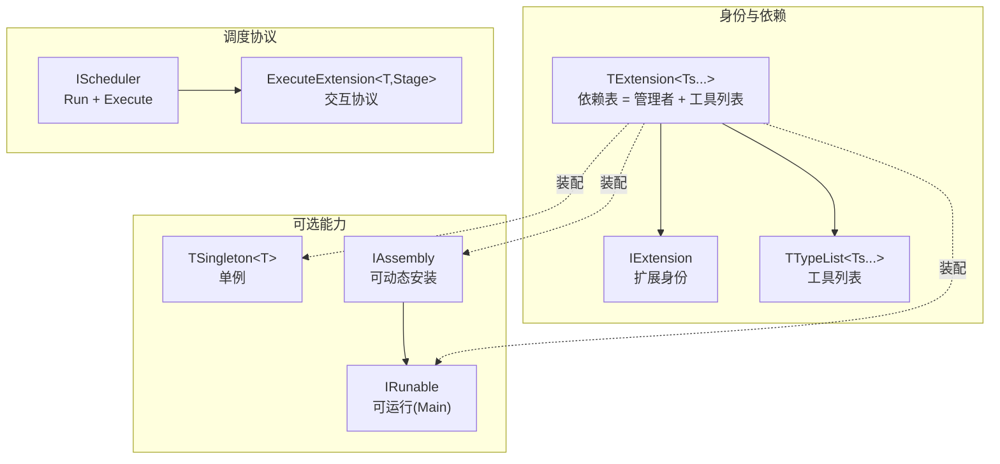

<!-- mahogen -->
# Core

## 代码文件

- [Assembly.h](Assembly.h)
- [Core.h](Core.h)
- [Delegate.h](Delegate.h)
- [Export.h](Export.h)
- [Extension.h](Extension.h)
- [Fatal.h](Fatal.h)
- [Runable.h](Runable.h)
- [Scheduler.h](Scheduler.h)
- [Singleton.h](Singleton.h)
- [Topology.h](Topology.h)
- [TypeList.h](TypeList.h)
<!-- mahogen end -->

## 概念——引擎基础设施

Maho 核心是**零 app 假设、零三方依赖、零 stage 预设**的纯积木。下面从"身份 → 能力 → 协议 → 列表"四层讲清每个概念。

### ① 扩展身份与依赖表

**`IExtension`** —— 所有扩展的根身份（只有一个虚析构）。

**`TExtension<TExtensions...>`** —— **依赖表 + 管理者**。它继承 `IExtension`（于是隐式地把自己变成扩展）和 `TTypeList<TExtensions...>`（工具列表）。

```cpp
template <typename... TExtensions>
class TExtension
    : public virtual IExtension
    , public TTypeList<TExtensions...>
{
public:
    using FExtensions = TTypeList<TExtensions...>;
};
```

关键语义：**`TExtensions` 列表里的插件跟 `TExtension` 不是平级、也不是继承——它是"管理者"声明的"我要用到这些工具"**。真正的"拓展"（继承一个插件扩展它的能力）是直接继承 `class FMyPlugin : public FBasePlugin`，跟这个列表无关。

### ② 能力（可选，各自独立）

| 概念 | 语义 | 与单例 |
|------|------|--------|
| `TSingleton<T>` | 进程内唯一实例（Meyers 单例） | — |
| `IRunable` | 可运行（有 `Main`） | ✅ 兼容 |
| `IAssembly` | 可动态安装（`IRunable` + 导出 `CreateExtension`） | ❌ 互斥 |

`TSingleton` 和 `IRunable`/`IAssembly` 是**独立的可选能力**，插件自己决定要哪个：工具要单例、Layer 要"单例 + Main"、应用要"Assembly（导出）"。

### ③ 调度协议

**`IScheduler`** —— 调度器契约：`Run`（驱动一组可调用）+ `Execute<Stage, TExtensions>()`（按 stage 驱动扩展，外层 level 串行、内层并行/串行）。

**`ExecuteExtension<T>(Stage)`** —— 扩展与调度器的**唯一交互协议**。主模板是 no-op 兜底，应用侧对具体的 `(T, Stage)` 偏特化决定行为：

```cpp
// 应用侧（Driver）偏特化：FLog 在 EStage 下干什么
template <>
bool ExecuteExtension<Maho::Log::FLog, EStage>(EStage Stage) { /* ... */ }
```

调度器只负责 `ExecuteExtension<T>(Stage)` 的调用，stage 枚举和每个扩展的 stage 行为完全由应用侧决定。

### ④ 列表代数

`TTypeList` / `TCons` / `TAppend` / `TContains` / `TFilter<TList, TBase>`（按基类过滤，`is_base_of` 内联）。

## 关系图



## 相关文档

- [Core.h](Core.h) — 聚合头
- [CoreAPI.html](CoreAPI.html) — API 文档
- [../Engine/EngineDoc.md](../Engine/EngineDoc.md) — 插件模板（Tool/Layer/Engine）
- [../../Private/Core/CoreDoc.md](../../Private/Core/CoreDoc.md) — 实现算法字典
- [../../SourceDoc.md](../../SourceDoc.md) — 源码根
