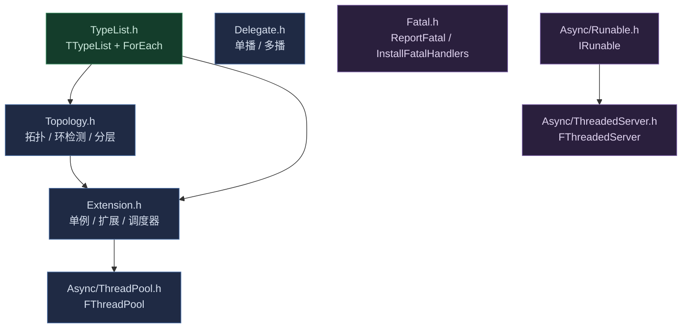

# Core — 引擎基础设施

Maho 的编译期基础设施 + 并发基础设施。所有高层模块（引擎壳、插件）都建立在这一层之上。

## 子模块

| 子模块 | 职责 |
|--------|------|
| [TypeList.h](TypeList.h) | 编译期类型列表 `TTypeList` + 运行时遍历 `ForEach` + 调度器概念 `FForEachScheduler` |
| [Topology.h](Topology.h) | 依赖声明（`TDependsOn` / `TDependsPack`）+ 编译期拓扑排序 / 环检测 / 分层 / 逆序 / 反向依赖 |
| [Delegate.h](Delegate.h) | 单播 `TDelegate` / 多播 `TMulticastDelegate` + 句柄 `FDelegateHandle` |
| [Extension.h](Extension.h) | 单例 `TSingleton` + 扩展 `TExtension` + 调度器（串行 / 并行）+ 静态装配载体 `FExtensions` |
| [Fatal.h](Fatal.h) | 致命路径 `ReportFatal` + `InstallFatalHandlers`（零依赖，崩溃兜底） |
| [Export.h](Export.h) | DLL 导出宏 `MAHO_API`（UE 风格模块边界） |
| [Async/](Async/Async.md) | 并行模型：`FThreadPool` + `FThreadedServer` + 可运行契约 `IRunable` |

## 依赖关系



分层：

- **`TypeList`** 最底层（类型 + 遍历）；`Topology` / `Extension` 依赖它
- **`Extension`** 依赖 `Topology`（拓扑）+ `Async`（线程池）
- **`Delegate`** 独立（纯 stdlib）
- **`Fatal`** 只依赖 `Export`，保证崩溃时刻零依赖

## 典型用法

```cpp
#include <Core/Core.h>

using namespace Maho;

enum class EPhase : std::uint8_t { Init = 0, Tick = 1, Shutdown = 2 };

// 扩展：继承 TExtension（依赖经 TDependsPack 显式声明）
struct FSystemA : public TExtension<EPhase, FSystemA>
{
	bool ExecuteStage(EPhase Stage) override { return true; }
};

struct FSystemB : public TExtension<EPhase, FSystemB>
{
	bool ExecuteStage(EPhase Stage) override { return true; }
};

// 静态装配：继承列表里放 FExtensions<...>，FList 是装配好的 TTypeList
class FRunner
	: public TParallelScheduler<EPhase>
	, public FExtensions<FSystemA, FSystemB>
{
public:
	void Tick()     { Execute<EPhase::Tick, FList>(); }
	void Shutdown() { Execute<EPhase::Shutdown, FList, FReverseTopology>(); }
};
```

装配只落在 `using FExtensions<...>` 一行；扩展本体仍是 `TExtension` 单例，调度器靠 `T::Get().ExecuteStage(Stage)` 驱动。

## 相关文档

- [Core.h](Core.h) — 聚合头
- [Core.html](Core.html) — API 文档
- [Async/Async.md](Async/Async.md) — 并行模型概念
- [Async/Async.html](Async/Async.html) — 并行模型 API
- [../Maho.md](../Maho.md) — 引擎核心（`FEngineBase` / `FSingletonRegistryBase` 消费本层）
