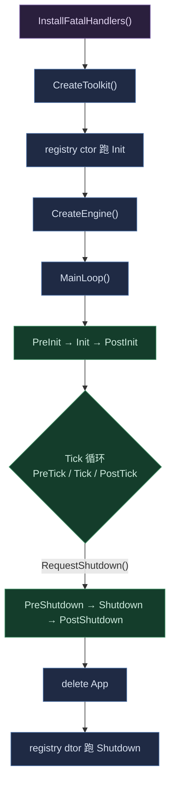

# Maho — 引擎核心

引擎壳层：`FEngineBase` / `FToolkitBase` 消费 Core 的调度器 + 扩展体系，是 code-gen 装配的目标基类。聚合头 [Maho.h](Maho.h)。

## 两个基类

| 基类 | 调度器 | 用途 |
|------|--------|------|
| `FToolkitBase` | `TSerialScheduler<EToolStage>`（串行，无池） | 预 app 工具包：`Init` / `Shutdown` |
| `FEngineBase` | `TParallelScheduler<EEngineStage>`（并行，持池） | App 引擎：完整生命周期 + `MainLoop` |

两者都是抽象基类（生命周期方法纯虚），项目侧 code-gen 生成具体子类并静态装配 `FExtensions`。

## Stage 枚举

- `EToolStage`：`Init` → `Shutdown`（2 值）
- `EEngineStage`：`PreInit → Init → PostInit → PreTick → Tick → PostTick → PreShutdown → Shutdown → PostShutdown`

## 生命周期



## 装配方式（code-gen）

code-gen 扫插件配置表（`.cplugin`），项目侧生成两个类，在**继承列表**里静态装配 `FExtensions`：

```cpp
class FGameSingletonRegistry final
	: public FToolkitBase
	, public FExtensions<FLog, FTimer>
{
public:
	FGameSingletonRegistry() { Init(); }
	~FGameSingletonRegistry() override { Shutdown(); }

protected:
	void Init() override     { Execute<EToolStage::Init, FList>(); }
	void Shutdown() override { Execute<EToolStage::Shutdown, FList, FReverseTopology>(); }
};

class FGameEngine final
	: public FEngineBase
	, public FExtensions<FRenderSystem, FScriptSystem, FPhysicsSystem>
{
protected:
	void PreInit() override { Execute<EEngineStage::PreInit, FList>(); }
	void Tick() override    { Execute<EEngineStage::Tick, FList>(); }
	// ...其余 stage 同理；Shutdown 用 FReverseTopology
};
```

要点：

- 装配只落在 `public FExtensions<...>` 一行，`FList` 从基类继承。
- registry 的 `Init`/`Shutdown` 在**派生**构造/析构体里调用（虚分派安全）；基类保持纯虚。
- `FEngineBase::MainLoop` 是 `final` 模板方法，项目类不能覆写；`RequestShutdown()` 供 extension 在 Tick 中触发退出。

## EntryPoint

[EntryPoint.h](EntryPoint.h) 是平台无关的共享驱动（`MahoMain` + 工厂声明）。平台入口 shim 各一个，游戏项目单 `.cpp` 按目标平台 include 其一：

| shim | 入口 | 平台 |
|------|------|------|
| [EntryPointWindows.h](EntryPointWindows.h) | `main` + `WinMain` | Windows |
| [EntryPointLinux.h](EntryPointLinux.h) | `main` | Linux |
| [EntryPointAndroid.h](EntryPointAndroid.h) | `android_main` | Android |
| [EntryPointIOS.h](EntryPointIOS.h) | `RunIOS()`（ObjC 入口调它） | iOS |
| [EntryPointXbox.h](EntryPointXbox.h) | `main` | Xbox (GDK) |

流程（`MahoMain`）：

1. `InstallFatalHandlers()`（装 `std::terminate` 兜底，早于一切）
2. `CreateToolkit(Argc, Argv)` → `unique_ptr` RAII（ctor 跑 ParseCommandLine + Init，dtor 跑 Shutdown）
3. `CreateEngine(Argc, Argv)` → `IRunable*`（ctor 跑 ParseCommandLine）
4. `App->MainLoop()` → `delete App`
5. `try/catch` 兜底 → `ReportFatal`

`CreateToolkit()` / `CreateEngine()` 是项目侧契约（code-gen 生成）。

## 相关文档

- [Maho.h](Maho.h) — 聚合头
- [Maho.html](Maho.html) — API 文档
- [Core/Core.md](Core/Core.md) — 基础设施概念
- [Core/Async/Async.md](Core/Async/Async.md) — 并行模型
- [../Plugins/README.md](../Plugins/README.md) — 插件总览
