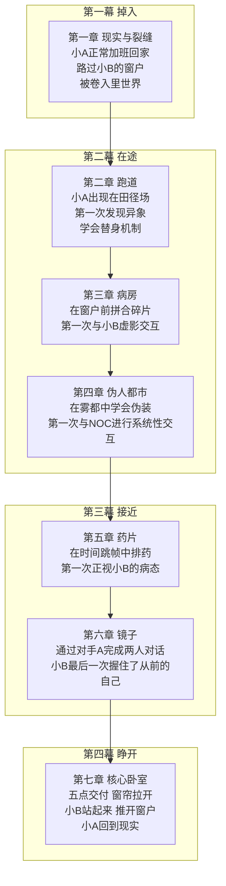

# 梦境游戏剧情策划案（修订版 v2）

> 类型：心理恐怖 / 叙事解谜 / 轮回探索
>
> 灵感来源：寂静岭 × 盗梦空间
>
> 一句话梗概：一个年轻程序员在深夜翻看旧聊天记录时沉入梦境，发现自己坠入了一个叫小B的女孩的内心世界。她是他从未当面见过的人，也是他在三个月前失去联络的人。他必须穿过五层由她的记忆构筑的里世界，替她走完那些她被困住的路——不是为了把她救回来，而是为了弄清一件事：这段相遇，到底值不值得。

---

## 目录

1. [第一章：故事概要与世界观设定](#第一章故事概要与世界观设定)
2. [第二章：角色设计](#第二章角色设计)
3. [第三章：关卡范式与示例设计](#第三章关卡范式与示例设计)
4. [第四章：核心叙事机制](#第四章核心叙事机制)
5. [第五章：完整叙事弧线与章节大纲](#第五章完整叙事弧线与章节大纲)
6. [第六章：多结局设计](#第六章多结局设计)
7. [附：与梦境碎片的对照](#附与梦境碎片的对照)

---

## 第一章：故事概要与世界观设定

### 1.1 一句话梗概

小A是一个普通的年轻程序员。三个月前，一个女孩从他的好友列表中消失了。她没有删他——她发了最后一个挥手，然后注销了账号。他再也没有联系上她。

某个平凡的夜晚，他在手机上翻到了三个月前的那条聊天记录。不是刻意翻的——手指在屏幕上无意识地滑动，那条消息就从底部浮上来了。他看着那个挥手，然后困了。然后他睡着了。

他发现自己不再是在床上——而是在一个田径场上，阳光永不落下，发令枪永不鸣响。他进入了小B的内心世界。

这个女孩叫小B，十八岁。十二岁那年，她在升学比赛的起跑线上摔断了腿，本该是她的第一名被第二名的女孩取代。此后三年她躺在医院，腿接上了，但身高永远停在了 149 厘米。出院后她再没有回到学校，不再出门，窗帘从那天起没有拉开过。严重的抑郁症和躁郁症让她每天靠一把精神药物度日。她打砸东西，鬼哭狼嚎，咬自己的手臂。

小A必须穿过五层由她记忆构筑的里世界，替她走完那些被困在原地的路。但这次的真正问题是——他不是在拯救一个陌生人。他是在重走他们从相遇到分离的全程。而当他走到最深处的时候，她会在那里等他。她会问一个问题。他的回答将决定一个时间的起点。

### 1.2 世界观

#### 1.2.1 表世界 = 现实世界

表世界不是游戏中的一个"层"。它就是现实。是小A的出租屋——桌上那杯凉掉的咖啡，手机屏幕还亮着。聊天界面的最后一条消息是三个月前，她发的那个挥手。所有"正常"的东西都在表世界里。

表世界本身没有任何超现实元素。唯一的例外是：小A的手机屏幕在某一刻变成了一个入口。他没有"跨过去"——他只是看着那条旧消息睡着了。醒来时，他已经不在自己的房间了。

#### 1.2.2 里世界 = 关卡

每一个关卡都是一个里世界。里世界不是凭空生成的——它是由小B某一段经历的**完整时空切片**构成的。切片的内容是某个真实场景（田径场、医院病房、出租屋、街道），但运行规则由小B的心理投射决定。

里世界的恐怖不在于"怪物追逐你"，而在于**环境的某一处异常无法被忽视，但场景中的所有人都在若无其事地继续做他们的事**。

**每个里世界都有一条不可忽视的环境异常**：
- 有的场景太阳永远不会升起来，永远是凌晨五点的灰蓝色
- 有的场景到下午四点准时起大雾，雾浓到伸手不见五指
- 有的场景时间不以连续的节奏前进，而是突然跳帧——一眨眼，十分钟没了
- 有的场景中空间是错乱的：走廊越走越长，房间的比例不对，楼梯总是把你送回来

**NPC 在这条异常面前的反应永远为零**。

运动会场的选手们在永远不会响的发令枪前一遍遍地做热身。医院病房的护士在窗外永远同一帧晴天的背景下记录着体温。街上的行人在伸手不见五指的浓雾里刷卡进地铁站、等红绿灯、讨论今晚吃什么。这些行为本身是正常的——热身、查房、通勤、择菜做饭——它们都是日常生活中正确的事。但在一个已经明显不正常的场景里，它们变成了最恐怖的画面：因为这意味着，除了你，没有人在意这个世界已经坏了。

这是小B精神状态的映射：她被困在她的创伤里，而整个世界都在照常运转。受伤的是她，日子继续过的是别人。

#### 1.2.3 里世界的进入与退出

小A穿过入口后落入了第一个里世界——比赛日的那条跑道。他不知道自己在哪，只知道场景和现实有一处不太对劲。当他逐渐辨认出那一处异常（发令枪从来没有响，太阳没有挪过位置）、理解到这一段的遗憾核心（小B没有跑到那场比赛）、并以某种方式"替她完成"那段遗憾事件后——里世界崩塌，通往下一层里世界的入口出现。

层次不是物理上的向下，而是心理上的**向深**——越深入，场景越靠近小B人生的现在、越靠近她封闭自我的原点。

#### 1.2.4 轮回机制的本质

如果在里世界中做出了错误的判断——错过了关键的线索、选择了错误的解法、或被怪物（小B恐惧的外显）击败——该层里世界会重置。时间回到该层入口，但小A保留部分记忆（最强烈的情绪碎片）。

轮回本质上就是小B自己在做的事情：她反复回想同一段创伤，走不出来。小A的轮回是用他的身体去经历小B每天在做的事。轮回次数越多，小B的内在世界越不稳定——场景开始破损、NPC 开始消失、关卡之间的边界开始模糊。

---

### 1.3 核心主题

| 主题 | 在故事中的体现 |
|------|---------------|
| **创伤** | 小B的断腿是她生命的断裂点。十二岁之前的她和之后的她是两个人。 |
| **停滞** | 小B的身体在十二岁停止了长高，她的精神世界也在那一天停止了生长。里世界的本质就是"一个无法播放到终点的时间切片"。 |
| **理解** | 解开遗憾的方式不是打败怪物，而是真正理解小B当时怎么了——她失去了什么、她害怕什么、她渴望什么。 |
| **替身** | 小A所做的事，本质上就是"替她"——替她跑、替她看、替她说。因为在她的脑子里，她自己已经做不到了。 |
| **相遇的意义** | 小A不是在救小B。他是在重新走一遍他们从相遇到分开的路——不是为了挽回，而是为了确认一件事：这段相遇，值不值得。小B在核心问他的那个问题——"如果给你一次选择，你会选从未遇见我吗？"——就是这个问题。 |

---

## 第二章：角色设计

### 2.1 男主·小A

**基本设定**：男，年龄模糊设定在二十五岁上下。程序员。独居。房间的陈设就是他的性格：桌面只有电脑、键盘、一罐喝到见底的无糖咖啡。墙上没有照片。窗台上没有植物。他用代码和别人交流，所以很少需要开口说话。

他们在一个社交平台上认识。她是唯一一个给他的代码博客留过言的人。留言很短——只是一个颜文字。

他私信了她。她回复了。从那天起他们开始了长达数年的聊天。她逐渐开心起来——至少他感觉得到。她发过来的消息越写越长，感叹号越来越多。他说过的一句"你今天能出门走了五分钟，这个是记录"被她截屏了，设为聊天背景。她告诉过他这件事，用的是那种不好意思但又忍不住炫耀的笑脸。那张截图他后来也在自己的相册里找到了。

她说过"你好，我叫小B，我喜欢洛丽塔。"这是她发给他的第一句完整的话。那天的记录他至今没有删。

**分开**：三个月前，他们不再说话了。没有吵架，没有误会。只是她在某一天忽然说"你太好了，我不配"，然后发了一个挥手，注销了账号。他没有去追。他做的选择是——在她沉默的时候选择了不追问，在她注销之后，选择了不通过其他方式找她。他从头到尾都尊重了她的边界。但三个月来，他不知道那个选择对不对。

**现在**：他一个人刷着手机，手指无意中滑到那天的聊天记录上。那个挥手停在屏幕中间，消息发送时间是凌晨三点。关掉页面，在困意中睡着了。他进入了一个不属于自己的世界——一个他应该在三个月前就该来的地方。

**心结**：不是愧疚。他没有对不起她。从头到尾他都在用他能做到的最好方式对待她。但他一直在问自己：如果有某一次，他做了不同的选择——她沉默的时候他追问了一句，她注销之后他试着找到她——结局会不会不一样？他不知道。他可能永远都不会知道。但在这个由她的记忆构筑的世界里，他也许能找到答案。

**性格弧线**：从"尊重边界的人"到"愿意越过边界的人"。他在现实中选择不打扰，在里世界中却被迫踏进她的每一道裂口。他在每一层里世界替她完成的不是她的遗憾——是他们没有一起做完的事。

**在里世界中的角色**：独行者。没有战友，没有分工。他一个人完成所有的事——观察、判断、行动。所有的 NPC 都是小B记忆中的投影。唯一真实的存在只有他自己和散落在各层中的小B的人格碎片——那些碎片有时看到他时会停顿一下，像某个人在很久以后认出了一个很久以前认识的人。

---

### 2.2 女主·小B

#### 基本设定

十八岁，女性。留短发（住院期间为了方便剪的，后来再也没有留长），身高 149 厘米。很瘦，锁骨突出。左小腿上有一条长长的手术疤痕。因为长期服用精神药物，她的动作有时会迟缓，嘴唇偶尔会轻微颤抖。但她的眼睛很大，即使在这种状态下也很大——她习惯用眼睛盯着一个地方不动，因为身体太累了。

她喜欢洛丽塔、小裙子、小动物，喜欢所有可爱的东西。有一天她在二手平台上挂了一套洛丽塔——只穿过一次，标签还没有剪。再也没有买过新的了。她现在的日常着装是旧睡衣，穿了七年的那套。但床头还摆着一只三年前在某宝上买的小羊公仔——19 块 9 包邮。她抱着它睡觉。它不是在帮她入睡——它是在帮她不咬自己的手。

她有躁郁症和抑郁性神经症（并发症），每天服用大量精神药物。她有慢性肺炎——可能是因为长期封闭在家、不通风导致的。发病时，她会不受控制地砸东西、撕东西、用牙咬自己手臂内侧。安静下来后，她会一个人坐在房间角落里，抱着自己的腿，看着满地的碎片和墙上的齿痕，无声地掉眼泪。她不是故意要这样。她恨自己变成这样。

她试过去打工。奶茶店的经理看到她的腿伤，没有多说什么——只是排班表上她的名字永远只排三个小时。久站的班排不了。搬货的班排不了。她一个月拿到的工资没有别人一周多。她沉默着上了一周的班，然后没有再去。

家里人明确说过了：满十八岁，家里不再负担你的生活费。你自己想办法。她没有想。她只是在日历上把十八岁生日那天画了一个圈，然后撕掉了那一页。

#### 创伤时间线

| 年龄 | 事件 | 对应关卡 |
|------|------|----------|
| 12 岁 | 升学比赛。她是赛前第一名种子选手，起跑时左腿胫骨螺旋形骨折，退赛。原本第二名的对手A代替她获得了第一名。 | 关卡① 比赛日·跑道 |
| 12-15 岁 | 住院三年。手术接骨成功，但骨骺线因创伤提前闭合，身高停止在 149cm。住院期间，她在病房窗口反复看到外面的运动会场景——不知道是真实的还是幻觉。 | 关卡② 病房·窗外 |
| 15 岁 | 出院返家。没有回学校。每天躺在床上。窗帘从那天起没有拉开过。手机屏幕亮了又暗，暗了又亮。尝试打工。失败。 | —（待扩展） |
| 16 岁 | 已卧床一年。第一次砸东西：水杯、台灯、闹钟。第一次咬自己。父母带她去看精神科。吃药的第一天。家人正式通知她，十八岁以后不再负担生活费。 | 关卡④ 药片·迷雾 |
| 17 岁 | 病情持续恶化。不再出门。卖掉了那套只穿过一次的洛丽塔。用换来的钱充了三个月的话费——为了能继续和一个人聊天。 | 关卡③ 伪人都市 + 关卡⑤ 镜子 |
| 现在·18 岁 | 精神世界完全封闭。躺在床上。手机离线。肺炎在冬天发作。现实中的她处于生命体征微弱的濒危状态。 | 核心 |

#### 核心创伤

不是摔断腿这件物理事件本身。而是事后所有人对她说的话。

"没关系，下次再参加。"——没有下次了。那场升学比赛的冠军保送省体校，她就差一步。

"腿接上了不就好了吗？"——但她再也没长高过。十二岁是她的永恒海拔。

"你要往前看。"——她在医院窗户里看了三年，往前看的每一帧都是别人在她的跑道上拿奖。

"你要吃药，吃了药就会好。"——吃了五年，还是没有好。

她最深的创伤不是受伤那天。而是接下来几年，所有人都希望她"快点好起来"，没有人问她"你失去了什么"。

---

## 第三章：关卡范式与示例设计

### 3.1 关卡范式（模板）

在展开具体关卡之前，先定义每个关卡的统一结构。基于小B的运动创伤背景和里世界的异象规则，一个关卡由以下五个要素构成：

#### 范式五要素

```
┌─────────────────────────────────────────────────┐
│  关卡名称：场景名 · 标题句                        │
│  对应年龄：小B当时几岁                             │
│                                                 │
│  ① 场景                                                    │
│     什么时空切片？                                    │
│     环境异象是什么？（太阳不动/准时起雾/时间跳帧/空间错乱...）  │
│     NPC 在做什么正常的事？（机械重复的日常动作）              │
│                                                 │
│  ② 遗憾核心                                     │
│    小B在这个节点失去了什么？                          │
│                                                 │
│  ③ 核心机制                                     │
│    小A需要"替她做什么"来弥补遗憾？                     │
│                                                 │
│  ④ 怪物（小B恐惧的外显）                          │
│    外观 · 行为 · 象征意义                           │
│                                                 │
│  ⑤ 解密路径                                     │
│    Step 0 到 Step N 的完整流程                       │
│    含失败条件与轮回触发                                │
└─────────────────────────────────────────────────┘
```

#### 范式流程模板

```
① 进入场景：场景"几乎正常"，NPC 在做日常的事。小A需要主动找出那条环境异常。
② 环境异常：辨认出异常后，场景不会自动改变——NPC继续正常行为，但小A开始看到关卡中的"裂缝"（线索物品、小B的人格碎片出没点）。
③ 赛博探索：在场景中收集线索。这些线索用来理解小B当时经历了什么。
④ 触发深处：接触到该层的关键物品或关键地点后，最外层伪装开始脱落。NPC 的"正常行为"开始出现细微但无法忽视的裂口。
⑤ 替身行动：小A替小B完成那段被中断的关键事件（机制因层而异）。
⑥ 崩塌或轮回：正确完成事件 → 该层崩塌，下一层入口显露。错误完成/被怪物压垮/放弃 → 轮回。
```

#### 后续关卡可扩展性

该范式与具体的人物创伤无关——它描述的是"一个被困在时间切片里的事件如何被外部介入者解开"。当未来需要扩展新关卡，只需将五要素映射到小B人生中另一个关键创伤节点即可。

示例（非本文详细展开）：
- 十五岁重返校园那天的开学典礼——环境异象：全校学生的身高在以肉眼难辨的速度缓慢增长，只有小B不增长。
- 第一次狂躁发作后独自收拾碎片的那一晚——环境异象：碎片会自动复原又自动碎裂，无限循环。
- 在精神病科室等待叫号的那个下午——环境异象：广播喊出名字后，站起来的人永远不会被叫到第二个。

---

### 3.2 示例关卡①「比赛日·跑道」——"发令枪再也没有响过"

**对应年龄**：12 岁

**① 场景**

一座市体育中学的标准田径场。阳光充足，蓝天白云，空气干燥，是完美的比赛日天气。八条跑道上各有一名选手在热身：压腿、高抬腿、短距离冲刺、再退回去。场边有教练、裁判、零星几个家长。远处的主席台上挂着横幅，红底白字写着那场比赛的全名。

环境异象：**太阳的位置从来没有移动过**。小A注意到这一点，是因为地上有一片由顶棚投下的阴影。阴影的形状和他在现实中踏入运动会场时的第一秒完全一致——连一个像素都没有变过。

NPC行为：运动员们机械重复热身动作——压腿十次、高抬腿二十步、冲刺三十米、退回去。永远重复。裁判站在起跑线旁，侧头看着跑道的尽头。举着发令枪的手悬在空中，手指扣在扳机上，但发令枪从来没有响过。场边的教练们在看秒表，秒表的走针在以极微小的幅度来回跳动，从不跨越整秒。

**② 遗憾核心**

小B失去了"跑完这场比赛的机会"。这不是一场普通的比赛——这是升学选拔赛，冠军直接保送省体校。小B是去年全省同年龄组的第一名。她的教练说过："正常发挥就够了，你稳的。" 她以后再也没有听过"你稳的"这三个字。

**③ 核心机制·替她跑完**

小A不能替小B"跑"。因为在这个里世界，跑道的尽头不是终点线，而是一道记忆的门——只有小B的像才能穿过。但小B的像站在起跑线上，一直处于起跑姿势。她的左腿是完好的，但她一动不动。

小A需要在场景中收集线索，找到"为什么她跑不了"。答案是赛道旁边的那排观众席。观众席上坐着的人——教练、裁判、后来的护士、父母——他们的嘴里都在说同一句话。凑近听，他们说的是世界上所有对伤者说过的最正确也最无用的话："没关系，下次再来。" "腿能走路就不错了。" "你看，那个谁谁谁连腿都没有，人家不也活得好好的。" "你要往前看。"

**替身行动**：小A不需要替她跑。他需要替她做一件她没有机会做的事——对那些观众席上的人说"停下"。每当他说服一个人停止重复那句话，起跑线上的小B的姿势就会向前倾斜一厘米。当所有人都不再说话时，她的左脚离地——在那个被冻结的时间切片的最后一帧里。

她跑不出去。时间碎片不播放最后一帧。但她的左脚已经离地了。这已经是她能在梦里做到的最好的一步了。

**④ 怪物·裁判**

外观：人形，穿白色裁判制服，胸前挂口哨。没有面部——面部区域是一块被涂黑的平面，但平面在缓慢变形，像有人在黑纸的背面不断用手指往外顶。口哨在无面部的情况下依然能吹响——那声音一响，所有跑道上的运动员都会立刻回到起跑线上，重来一轮热身。

行为：裁判不追人。它匀速沿着跑道行走，路过每一名运动员时会用没有眼睛的脸看他们一会儿，然后继续走。当它走过小B的起跑线时，小B的身体会晃一下——不是倒，是被什么东西按住了的那种晃。

象征：裁判代表"判决"——那场比赛中，判决是她不能跑了。她接受了一生。

**⑤ 解密流程**

```
Step 0. 进入场景：八条跑道，发令枪不响，太阳不动。
Step 1. 接近起跑线上的小B → 她只是一个虚影，不可触碰。但她左脚的号码布上写着一行
       小字，需要凑近读出 → 那是第一个线索："他还欠我一个时间。"
       翻到号码布反面——有一个手绘的迷你兔子。不是正经兔子，是一个小孩画的
       简笔画，两只耳朵一条身子四条短线。她十二岁的时候还喜欢画兔子。
Step 2. 绕场探索：观众席上坐着六个人，每个人在重复同一句话。收集这六句话。
Step 3. 分析六句话 → 按时间排序：比赛日当天说的 → 术后说的 → 出院说的 → 最近说的。
       按顺序依次回应。
Step 4. 每个人被回应后陷入沉默。一个接一个。六个全部沉默后，裁判走向小B。
Step 5. 裁判靠近小B → 小A挡在她前面 → 裁判吹哨，但这次它自己停下来了。
       因为跑道上的小B左脚离地了。
Step 6. 赛道崩塌 → 跑道从另一头卷过来，形成一个圆环，圆心是一条狭窄的医院走廊。

如果失败：
→ 裁判吹哨，热身重来。小A回到Step 0，保留"六句话内容"的记忆。
  第二次轮回：观众席上多了一个人——小B的教练。
  第三次轮回：某些观众开始出现裂口，他们说的那句话被扭曲了。
```

---

### 3.3 示例关卡②「病房·窗外」——"同一个晴天的第 1095 次日出"

**对应年龄**：14 岁（住院中期）

**① 场景**

一间六人骨科病房。白墙白被单白窗帘。病床上躺着五个模糊的人影，第六张床空着——那是小B的床位，被子叠好，床头柜上放着一杯凉了的水和一个铁盒。

环境异象：**窗户外面永远是同一个场景**——田径场，阳光明媚，跑道尽头站着一个小小的穿蓝色运动服的人影。是十二岁的小B，在等发令枪响。不管外面的天气是冷是热还是刮风下雨——这扇窗户永远在播放小B的十二岁那天的那条跑道。

NPC行为：护士每天在固定时间进来查房。量体温、看输液瓶、给隔壁床换药。她们做这些动作时不会看窗外。不是"刻意不看"——是她们的视线经过窗户时被截断了。窗户在她们的视网膜上不存在。医生巡房、病人家属探视、保洁换垃圾袋。所有的人都机械地完成病房里的日常，窗外是一个几十米宽的巨型屏幕播放着一场永远不响发令枪的比赛——没有人注意到。

**② 遗憾核心**

小B在这扇窗户前度过了三年。每一天，只要她有力气坐起来，她就看窗外。她在看什么？她在看"如果那天没有摔断腿，她现在在做什么"。她是在看一个平行世界里没有受伤的自己。

那个平行世界在窗外。但窗户是打不开的。

**③ 核心机制·不再看窗外**

小A进入病房后，发现小B的床头柜上放着一个铁盒。铁盒是她十二岁时的随身小物——装有她的宿舍钥匙、一枚跑道号码布、一张队友合影。合影被泡水过，因为住院不久后她有一次情绪失控，打翻了床头柜上的水杯——在水渍的掩盖下，照片上的队友的脸都模糊了。

关键物品：铁盒里的合影被水泡过。但如果仔细观察照片的反面，会发现在水渍的夹层中夹着一张纸条——那是住院期间一个队友写给她的信，护士夹在照片背面，但小B因为情绪失控一直没有发现。照片正面——队友们在她石膏上画满了花。腿上的那朵向日葵歪得不成样子，花瓣全是洛丽塔风格的波点。

纸条上写着："你什么时候回来？跑道上少了一条线。那条线是你，你不在的时候领跑线是歪的。"

**替身行动**：小A需要把这封尚未被小B读到的信读给她听——不是读给这个空病床，而是读给窗口边反复出现的那个十二岁的虚影。读完每一个字后，小A需要问她一件事：除了窗外，还有什么是你在这里三年里留下来的？铁盒子里还有什么别的东西？

小B虚影的回答将引向一段隐藏的记忆——在住院的第二年，她画了一幅画。画的是一个跑步的人。护士把画贴在她的床头，后来换床的时候弄丢了。小A需要在病房找到这幅画的碎片，拼合后放在窗户上。

画贴在窗玻璃上的瞬间——窗外的场景发生了变化。跑道不再是静止的。风在吹，云在动。那个穿蓝色运动服的小小身影——小B自己——向前迈了一步。

然后窗玻璃碎了。所有玻璃碎片反射出的都是病房室内——不是跑道。

她终于把目光从窗外收了回来。

**④ 怪物·访客**

外观：身高不等的模糊人形，穿着现实世界中的各种衣服——运动服、白大褂、校服、家常毛衣。他们走在病房的过道上，从一个病床走到另一个病床，坐下来一分钟，然后站起来离开。他们都长着小B认识的人的脸。

行为：访客走到小B的病床前，会说一句话——每句话都是来自现实世界中某个人探病时说过的话，其中包括：
- "你会跑起来的。"
- "你太瘦了，要多吃点。"
- "以后别跑步了，太危险。"
- "你看，比你惨的人多的是。"

这些访客不是怪物——他们是小B记忆中每一句"为你好"的话的聚合体。如果小A在它们说话时试图打断、反驳或发怒，访客会停下来，转向小A，然后沉默。沉默的访客太可怕了——它开始看着窗户。而一旦它看了窗户，就再也不会移开了。如果病房里有三个以上看着窗户的访客，小B的虚影就会开始变淡。

**⑤ 解密流程**

```
Step 0. 进入病房：窗外的跑道，永远不响的发令枪。
Step 1. 探索床铺 → 找到铁盒 → 打开，发现水泡过的合影和夹层中的纸条。
Step 2. 窗口边出现小B的十二岁虚影 → 读纸条给她。
Step 3. 访客开始出现 → 避开它们，不能让它们看窗户。
Step 4. 在病房各处找到"画的碎片"（共四块：头、身体、左腿、右腿）。
       左腿碎片隐藏在一名访客的手中——需要接近这名访客但不被它直视。
Step 5. 拼合画作 → 贴到窗口 → 窗景变化，小B迈出一步 → 玻璃碎裂。
Step 6. 所有碎片反射室内 → 小B的虚影转过来看铁盒 → 她第一次低下头看盒子里的东西。

如果失败：
→ 三个以上的访客望向窗外 → 小B虚影消失 → 病房灯光熄灭 → 轮回。
  第二次轮回：窗外的画面离病房更近了一点。
  第三次轮回：护士偶尔会看向窗户——只是偶尔，一闪而过，但那是第一次。
```

---

### 3.4 示例关卡③「伪人都市」——"没有人注意到雾里站着一个人"

**对应年龄**：16 岁（出院后，辍学早期）

**① 场景**

小B租房所在街区的街景：一排旧居民楼底商（诊所、便利店、小饭店、手机维修店）、一条四车道马路、一座过街天桥、三个公交车站。路上行人不算多，但刚好足够让街道感觉"有人"。

环境异象：**每天下午四点准时起雾**。雾不是慢慢来的——是瞬间降临的。手机时间跳到 16:00 的那一刻，远近八方的能见度同时压到不足两米。雾里什么也看不见，但你还能听见雾里有人——扫地声、塑料袋被风刮起又落下的声音、有人在打喷嚏。雾在凌晨四点是准时散去，然后下一个 16:00 再次降临。时间在继续走——一天又一日的循环，雾来了又散，但雾来的时候，小B永远站在公交站台的同一个位置。她身穿一件褪色的运动服外套，长到几乎过膝——那是她十二岁那年最大的一件外套，现在穿在身上反而成了累赘。

NPC行为：雾里的所有路人都在继续自己的人生。他们看得见雾吗？也许。但他们的应对方式是：放慢脚步、裹紧外套、低头看手机、加快一点走向目的地的步伐。没有人停下来望着雾说句"怎么又是雾"。他们只是像应对任何一种正常天气——像雨、像风、像降温——一样地应对浓雾。这意味着他们没有能力察觉这个里世界的异常。他们就是异常的一部分。

**② 遗憾核心**

出院后，小B回到了社交世界——但她发现自己和所有人之间隔了一层雾。人们继续过自己的日子，上学、恋爱、比赛、换城市。而她停在十二岁那年。她的社交关系全员断层：老队友在省体校、老同学在高中、新邻居不知道她是谁。她的世界是一团雾——她自己清楚自己在雾里，但外面的人看不见她。他们只是从雾里匆匆走过。

**③ 核心机制·伪装渗透**

小A掉入这个里世界后，立刻发现自己不是隐形的——街上的"人"能看见他。但"他们"看见的是"另一个路人"。如果小A做出任何不符合路人行为逻辑的动作：跑、翻墙、敲门、对着空气说话——周围的路人会停下脚步，看向他。停下的瞬间，雾在他们周围变得更浓。三秒后，他们会无表情地朝他走来。不是攻击，是靠近——靠得极近，近到小A可以数清对方的睫毛。

伪人不是攻击性怪物。它们靠近你只是因为你"不正常"。它们被程序化了——当环境出现不符合预测的因素时，它们需要"检查"。"检查"的威胁在于：如果小A被太多伪人近距离包围，他在这个里世界的"存在感"就会过强，伪人的注意力密度高到一定程度——雾就不再散了。这个关卡就锁死了。

伪装规则：
- 与所有路人保持至少三米距离
- 步行速度与他人一致
- 不停留、不跑、不碰公共设施
- 遇到十字路口时等绿灯——伪人等，你也必须等
- 不主动对人说话；如果被说话（伪人偶尔会上前问路），回答不能超过五个字，视线不能对上超过两秒。

**关键场景·公交站台**

小B站在公交站台前等着一辆没有线路号码的公交车。每天下午的雾中，那辆车会来——但它会在小B抬头迈步之前就关门开走。小A需要在雾升起的下午四点，做小B没有做成的事：上那辆车。她的运动服外套领子内侧还别着一枚塑料蝴蝶结胸针——毛边已经磨没了，颜色褪了，但还别着。她十二岁别上去的，之后就再没换过一件外套。

上车的条件是：
- 在公车进站时保持标准站姿，不前倾、不招手
- 车门打开后等两秒再迈步（与小B行为的微小差异足够让"系统"不识别为同一个犯错者）
- 上车的瞬间轻声说一句"雾里有人"（车上唯一一句超出五个字上限的话）

如果上车成功——公交车内部是一个四壁雪白的空间。没有窗户。没有司机。只有最后一排座位上坐着一个人——那是小B的另一个人格碎片。她没有说话，怀里抱着那条蓝色的运动服外套。

**④ 怪物·伪人**

外观：外观与正常行人完全一致。只有一处不同——眼角。伪人的眼角始终是干燥的。不是"不流泪"的干燥——是物理上的干燥，像一块很久没有被人用手指碰过的瓷砖。小A在近距离被"检查"时可以注意到这一点：眼前这张脸的所有细节都是标准的人类面部，但眼角没有一丝湿润的痕迹。没有泪液。这是个不会产生泪液的人。

行为：已在上文详述。核心设计点：伪人不是敌人。它们是小B眼中"正常世界"的化身——一个运作良好、每天准时起雾、准时散雾、从不哭泣的完美系统。小B害怕它们不是因为它们会伤害她，而是因为她在它们中间找不到自己。

**⑤ 解密流程**

```
Step 0. 降临到大雾将至的街头。当前时间：下午 3:57。三分钟后第一场雾。
Step 1. 第一次雾 → 被吓到 → 冲撞路人 → 被围观 → 雾封锁街道 → 轮回。
       第一次轮回保留记忆："它们不会在雾里攻击你，但你不能引起注意。"
Step 2. 第二次雾（轮回后重新开始） → 保持伪装，观察公交站台的小B。
Step 3. 在雾间歇期（凌晨四点至下一个四点）收集线索 → 绕街巷探索。
       找到小B在附近一家诊所的处方记录，一家便利店的店员还记得她。
Step 4. 下一次雾 → 走到公交站台附近 → 坐在长凳上以标准姿势等待。
Step 5. 公交车来 → 成功上车。
Step 6. 车内对话 → 小B人格碎片说："他们都是真的吗？外面那些人？"
       小A回答："他们是真的。你是真的。雾也是真的。"
       车厢变透明 → 能看到外面的街景 → 雾在退散（不是下午四点也不是凌晨四点，这是第三次雾散）
Step 7. 退出车厢 → 公交站台下一条路通向第四层。

如果失败：
→ 被太多伪人"检查" → 雾变为永久 → 轮回。
  第二次及以后轮回：伪人更警觉。新伪人出现在站台旁——一个永远在读报纸的女人。
```

---

### 3.5 示例关卡④「药片·迷雾」——"请按时服药"

**对应年龄**：17 岁（病情恶化期）

**① 场景**

小B的出租屋室内。一室一厅，不大。客厅的茶几上摊着外卖盒和空的药瓶。墙上有多处凹陷和刮痕——全是发作时留下的。卧室更小。床、一个塑料衣柜、一张被推到墙角的书桌。书桌上什么都没有。床头上有一瓶水泛着白色的沉淀物——不是水垢，是碾碎的药粉。

环境异象：**时间不是连续的**——它以五到十分钟为单位跳帧。小A看着挂钟，秒针在走——走六十步后分针动一格。然后在他眨眼的瞬间，分针跳了十格。他没有眨眼，但时间跳了。他低头看自己的手——手指没有老，手表也没有快。消失的不是他的时间，是这个房间里的时间。

NPC行为：外卖骑手每天固定在上午十点和下午四点敲门。他把袋子挂在门把上，敲门三下，然后离开。偶尔有一个穿着药店工作服的人会来，把新的药袋也挂在门把上。没有人按门铃。没有人透过门缝往里看。没有人问里面的人是否还活着。

小B的身影在房间中流动——她在床上、在墙角、在窗边、趴在桌上、蜷在衣柜旁。她不是瞬移，她是在跳帧出来的空隙中改变位置，而小A错过了那些瞬移的瞬间。上一秒她在床上哭，下一秒同一张床是空的，她已经跪在垃圾桶旁干呕——干呕不是因为恶心，是因为她刚试图吞掉一瓣凉掉的橘子和四颗药。

**② 遗憾核心**

小B丧失了对"时间"的感知。不是因为药的副作用——药在帮她不发狂。是因为她的每一天都是同一天。没有学校，没有比赛，没有人来敲门和她说话，没有事需要被按时完成。她没有敌人需要战胜，没有目标需要抵达。失去了外部参照系后，时间变成了一个纯粹的内部感觉——而她的内部感觉是病态的。躁期时，一切太快。郁期时，一切太慢。她分不清什么快什么慢。她只知道自己每天四点吞一把药，七点再吞一把药，睡前再吞一把药。三把药之间是空的——什么也没有。

**③ 核心机制·区分药与药**

这一次，小A的替身行动不是替她跑一段路或登上一辆车。是替她做一个她做了千百遍但从未带着意图去做的动作：服一次药。

这个机制的核心难度在于**排序**。小B每天吃的药是五到七种——抗抑郁药、情绪稳定剂、抗焦虑药、助眠药、肺炎的抗生素，以及一两种小A认不出来的药。每种药的说明书上都有服用时间。但她的精神内科医生给她写的那张服药时间表已经被水泡过、被她自己撕掉了一块、被蜡笔涂过——现在挂在冰箱门上，一半看不清。那张纸的背面不是空白的——是从杂志上撕下来的一页洛丽塔模特走秀图。她把时间表写在背面。正面是美，背面是药。

**替身行动**：小A需要在这一层中收集齐全七种药的药名和服用说明，然后在一个完整的"一天循环"内，替小B把药按正确顺序服下。如果顺序正确，时间跳帧现象会缓解——挂钟的分针开始正常运转，一个完整六十秒的分钟是这层里世界中最美的一件事。

**④ 怪物·药瓶**

外观：一个放大了数倍的半透明橙黄色药瓶，悬浮在房间中央，缓慢自转。瓶身内装满白色的药片，它们会像鱼群一样在水中游动——不，瓶子里没有水，它们在干燥的瓶身内部以鱼群逻辑翻转。瓶口是打开的，偶尔会有药片掉出来。掉出来的药片落在地板上时，会化为小B某段短暂清醒的记忆声音："今天天气好好。""妈妈。""我不想吃这个。"——然后消散。

行为：药瓶不在追小A。它在呼吸。瓶子本身在微微膨胀和收缩，像一个不能咳嗽的肺。每当小A找到一种正确的药并放在床头柜上时，瓶内的药片游动速度会放慢。

**⑤ 解密流程**

```
Step 0. 进入房间 → 第一件被注意到的异常：时间跳帧。
Step 1. 观察小B → 她在不同位置之间跳跃。试着看她在一个位置上完整完成一件事
       （比如：把一杯水从桌上拿起，送到嘴边，喝完放回桌面）。如果小A能在
       跳帧之前记录到这件事的全程 → 跳帧现象的间隔会延长一秒。
Step 2. 收集药名 → 床头柜的药袋上有标签。垃圾桶里有废弃的包装壳。卫生间洗手台
       上有药膏。冰箱门上的时间表被毁，但剩下的部分能辨认出基础程序。
Step 3. 收集说明 → 每种药要找到说明书或药袋上的文字标注。有一份说明书卡在床
       垫下面，用力扯出时会掉出别的碎片——包括一张小B十二岁的运动员健康证。
Step 4. 按正确顺序排列 → 放入服药杯。每放入一个，挂钟的跳帧恢复一秒。
Step 5. 完整的服药杯放到小B面前 → 时间恢复正常流动。六十秒一分钟。
Step 6. 小B拿起杯子喝药 → 她第一次抬头看挂钟 → 她意识到自己在看着时间，
       时间也在看着她 → 在成为病人五年后，她第一次感觉到时间正在向前走。
Step 7. 卧室门打开，后面不是客厅——是一条通往更深的地方的走廊。

如果失败：
→ 药排错顺序 → 挂钟的指针开始加速到肉眼可见的速度。小B的身影开始以
  无法追踪的速度闪烁 → 空气变得僵硬 → 进入轮回。
  第二次轮回：跳帧现象从十分钟增加到二十分钟。
  第三次轮回：小B在跳帧空隙的短暂瞬间开始能够看到小A。
```

---

### 3.6 示例关卡⑤「镜子」——"我只是运气好"

**对应年龄**：15-18 岁之间（跨时间的心理纠葛）

**① 场景**

一个不规则的空间——形体上类似一条长廊，但墙壁、地面、天花板全部由镜子构成。不是规整的镜面，而是大小不同、角度各异的碎片镜面拼接而成的。没有统一光源，光来自镜面自身折射的彼此。廊中有四面特别的镜子，比其他所有镜子都大，悬挂在四个方位。每一面大镜映出不同年龄的小B——十二岁比赛日的小B、她穿着运动服，健康；十三岁住院的小B、她坐在病床上，腿上打着石膏；十六岁离开家门的小B、站在公交站牌下，无人陪伴；十八岁缩在卧室角落的小B，脸颊瘦削，手臂上有伤。

第五面镜子挂在长廊尽头，等身大小。镜中映出的不是小B。是另一个人——一个与小B同岁、身高正常、气色健康的女孩，长得并不像小B，但和小B穿着同款不同色的比赛服。她就是对手A。

**环境异象：镜中映出的人影会在镜中移动，但镜前并没有对应的真实实体。** 也就是说，镜面中的世界不是"反射"——它是另一套正在运行的时间。十二岁的小B在镜中跑步，十四岁的小B在镜中写日记，十六岁的小B在镜中公交上坐过站——这些都不是此时此刻正在发生的事。这是小B曾经做过的、或是想做但没做到的事，被撕裂开缝在了镜面后。

**② 遗憾核心**

对手A——那个在比赛中顶替了她的位置的女孩——一直活在小B内心的暗处。小B并不是恨她。更准确地说，小B不知道该怎么看待她。十二岁那次退赛不是对手A的错。但那之后的每一次——省体校的对内排名、她本该参加的全国性比赛、那张被印在母校宣传册上的运动员照片——都是对手A。她本该有的东西全部去了另一个人名下。

她没有办法恨她。她只是看着镜子中那个健康的同岁女孩，想：如果那天先倒下的是我，那天之后所有的她，都应该是我的。

但现在她想问的是另一个问题。一个更难开口的问题：你快乐吗？那些本该是我的东西——你在用。你觉得你配吗？还是你也一直在想我？

**③ 核心机制·和镜中人对话**

小A要在此层完成一件此前各层从未让他做的事：**他需要替小B开口，但对手A说出去的话会改变他的回答顺序。** 这是两个女孩隔着时空的对话，由小A以"小B的替代者"身份参与。

机制细规：
- 长廊中依次亮起的是四块小回忆镜。每块镜里有一段对手A说过的话（小B在现实中听到过），以及小B心里真正想回应的那段话——但她从来没有说出口。
- 小A收集这四段话后，最后走到第五面镜前面对对手A。
- 对手A的镜面会说五句话。其中四句是来自回忆镜的内容（小A已收集），一句是新话——那是对手A一直想对小B说但没有机会说的话。
- 小A可以用收集到的四段回应按任意顺序回击对手A的四句。但新话需要用一段全新的回应——这段回应的内容来自前面四层收集到的所有真相。

对话核心：

对手A站在镜子前，她的语气中没有一丝骄傲。她的第一句是小A在前四层回收中已经预料到的："你是来质问我偷了你的人生的吗？" 第三句是会扎进核心的："你以为我想要吗？你以为第一名的快乐是——每次被人叫到名字时都对着空气想说对不起吗？"

当她说到这句话时，镜子中央会出现一条裂痕。裂痕左边的影像是小B记忆中的对手A——她是一个沾沾自喜的胜利者。裂痕右边的影像是对手A记忆中的自己——她在体校第二年的成绩下滑到全队第八，教练对她说"你是因祸得福的，不努力就对不起那个躺医院的"。

小B不知道这件事。因为没人会告诉一个住院的伤者"你的对手正在失败"。而没人告诉她这件事本身，就是她孤独的原因之一。

**④ 怪物·碎镜者**

外观：由小块镜面碎片在空气中拼接成的飞行生物。它们不是你盯住就能看清的——你必须把视线移到它们旁边才能看到形状；如果正面盯住它们，它们会瞬间反射出小A自己的脸。它们飞过时发出玻璃碎裂声和一种模糊不清的自言自语——"那是我的""该是我""如果……"——这些是小B在现实中从未说出口的话。

行为：碎镜者在廊中随机来回。如果小A在一个区域逗留太久，碎镜者密度上升会模糊该区域的镜面内容——使小A识别回忆镜的速度降低。解法：保持在小范围移动，不要在一个镜子前停留超过一分钟。

**⑤ 解密流程**

```
Step 0. 进入镜廊 → 四面大镜 + 一面全身镜，碎镜者巡游。
Step 1. 依次读取四面回忆镜，每面镜读取一次可获得一段对手A的话以及
       小B应该回应的话。四段全部收集才可进入全身镜。
Step 2. 碎镜者在廊中扰镜 → 避开。本层的失败主要是"时间耗尽"而非被攻击。
Step 3. 全身镜激活。对手A的五句话逐一呈现。小A依次回应。
       前四句话用已收集的台词回应，最后一句话须从全部前四层的内容中拼合。
Step 4. 最后一句话的回应不能从任何台词列表中选择——它没有标准答案。
       它只能在当前的收集范围内根据故事主题进行推导回答。
       正确回应方向："她说她欠你一个谢谢。不是为了顶替你的位置的谢谢你，
       是为了你让她知道，站在最高处需要喘气。她从来没学会喘气。
       是你帮她喘了——用你的离开。"
Step 5. 全身镜裂开 → 两个女孩的镜像面对面。对手A走到镜框边缘，
       她把一样东西放在镜前的空地上——一块号码布。那是她第一次以体校代表
       身份参赛时佩戴的布条，背面写了一个极小极小的符号。凑近看——它不是
       字母"b"。它是一个兔耳朵的形状。她画的不是小B的名字。她画了一只兔子。
Step 6. 镜廊崩塌 → 通往最深处。

如果失败：
→ 最后一句话答错 → 所有碎镜者在瞬间凝固到全身镜上，将镜子粉碎。
  小A所在的空间变为极暗，只听见一声轻轻的"谢谢"——不是对手A的声音，
  是小B的声音 → 进入轮回。
  第二次轮回：回忆镜中多出一块碎片——对手A的日记片段。
```

---

### 3.7 核心·最深处

**视觉风格**：小B的卧室。没有任何异常。墙上的凹陷还在，床头的药瓶也在，窗帘还是拉着的。但挂钟在走——秒针一秒一秒地走，分针循规蹈矩地跟，一分钟是六十秒整。床头靠着一只小羊公仔，绒毛已经被摸没了。

小B坐在床边。完整的。不是碎片，不是投影，不是十二岁、十四岁、十六岁、十八岁的分身。是一个——十八岁，短发，149 厘米，左小腿上有疤，手臂上有齿痕——完整的小B。

她抬头。她看向小A。她在这个空间里第一次开口说话：

"你走完了。"

她没有问号。不是疑问句。她知道他会走完。她一直在等——不是被困在这里等他来救。她是在等他回来。

小A看着她。他说了一句他从来没在聊天记录里说过的话：

"我知道。"

——因为她说了"我叫小B"。她只是在确认一个他们都知道的事。

**核心机制·交付**

本次没有解密、战斗、收集的环节。只有一个行动：交付。

小A从口袋里取出这五层旅途中的五件东西。每件都不是他偷来或抢来的。有些是小B自己留在每一层的，有些是他们共有过的：

- 一块号码布（关卡①）。皱巴巴地印着当年那场比赛的全名。翻过来，反面有一个手绘的迷你兔子——不是正经兔子，是一个小孩画的简笔画，两只耳朵一条身子四条短线。他截过屏。她发给他看过。
- 一张被水泡过的队友合影（关卡②）。水渍已经干涸，模糊的队友面孔变成了五团温柔的蓝与白。石膏上的那朵向日葵歪得不成样子，但花瓣全是洛丽塔风格的波点。
- 不是便利店的收据——是她说过的一句话（关卡③）。聊天记录截屏里写着："今天出门了！！买了薄荷糖！！！！"从第一个感叹号到最后一个感叹号全都在。雾天那个公交站台上的她，是这段话在记忆中的肉身。
- 一张揉皱的药袋标签（关卡④），白色纸面上印着开药日期和被水晕开的药名。背面是一张从杂志上撕下来的洛丽塔模特走秀图。她把时间表写在背面。正面是美。背面是药。小字那行——【下一周我也坚持】涂掉→【明天我也坚持】涂掉→【今天】。
- 那块号码布——对手A的那一块，背面写着一个极小的"b"（关卡⑤）——但它不是字母。凑近了看，它是一只兔耳朵的形状。她写的不是谁的名字。她画了一只兔子。

小B把这些东西一样一样摆在床铺上。

**变化**：每摆一件，房间的窗帘自动向两侧拉开一分。

第五件摆完时，窗帘全开。窗外是白天。不是比赛日、不是病房、不是雾、不是跳帧的挂钟——是一个普通的、真实的、宁静的星期二下午。

小B站起来，走到窗前。她看着窗外说："很久没有拉开过窗帘了。"

**最终对话**：她转过头。她没有笑。她看着他，问了一个问题——一个她可能在聊天框里打了又删除、删除又打了无数次的问题：

"如果给你一次选择的机会——选择从来没有认识过我——你会选吗？"

小A的回答将决定结局。

**如果回答"不会"**：窗帘全开。她笑了——淡淡的，像冬天的第一片霜融化前，草地表面短暂发亮的那一下反光。

"我叫小B。今天星期几。"

"星期二。"

"好。"

她推开窗。外面的风吹动了桌上的药袋标签。那张被写了"今天"的纸片翻起来，在空中暂停了一瞬，然后落在小A摊开的掌心里。房间充满了光。

**如果回答"会"**：窗帘静止不动。她看着他，没有失望，也没有意外。她似乎早就知道这个答案。在某个深夜的聊天框里，她自己就是这样回答的——"如果我能选择，我不会让你认识我。"

她说："好。"

然后时间线开始回退。

---

### 3.8 关卡层级汇总表

| 层 | 名称 | 环境异象 | 核心机制 | 怪物 | 对应年龄 |
|----|------|----------|----------|------|----------|
| ① | 比赛日·跑道 | 太阳永远不移动 | 替她回应六句话 | 裁判（吹哨重置一切） | 12 |
| ② | 病房·窗外 | 窗外永远同一帧晴天 | 找到未读的信并读给她 | 访客（对视即锁窗） | 14 |
| ③ | 伪人都市 | 每天 16:00 准时起雾 | 伪装渗透 + 登上公车 | 伪人（不正常行为触发围观检查） | 16 |
| ④ | 药片·迷雾 | 时间跳帧（非连续） | 按正确顺序排列药物 | 药瓶（呼吸式的药片游动群） | 17 |
| ⑤ | 镜子 | 镜中世界不反射（自运行） | 与对手A隔镜对话 | 碎镜者（停留超过1分钟即封镜面） | 15-18 |
| 核心 | 最深处的卧室 | 挂钟正常走一小时六十分 | 交付五件关键物品 | 无 | 18 |

---

## 第四章：核心叙事机制

### 4.1 异象察觉（叙事层修订版）

在修订后的世界观中，异象不再是"隐藏在正常中的裂缝"——它是**一个无法被忽视但所有 NPC 都在无视的环境异常**。小A对异象的认知过程分为两个阶段：

#### 第一阶段：感官警觉

小A进入里世界后，会首先经历一段短暂的"一切正常"的错觉。然后他的感官会捕捉到环境中的那一个参数——光线的角度、空气的浓淡、时间的流逝速度、空间的连续性——它和现实不完全同步。

这个阶段持续很短。因为异象太大、太明显了。发令枪永远不响。窗前永远是同一天的太阳。雾像舞台幕布一样每天四点准时降下。挂钟跳帧。

#### 第二阶段：社交恐惧

异象确认后，小A会经历一种新的强烈不安——不是危险感，而是孤独感。因为他意识到：除了他，在场的所有"人"都在无视这个异象。护士不看窗，路人不在乎雾，运动员不等发令枪响就已经开始下轮热身了。这并不是恐怖游戏中被怪物注视的恐惧——这是一种反向恐惧：是你在注视着世界，而世界不注视你。**你是不被看见的唯一正常人。**

小A的异象察觉能力来自于他的性格——一个习惯观察多于参与的、有些孤独的程序员。他在现实生活中就对模式敏感（他的工作是发现代码中的逻辑漏洞），而在小B的精神世界中，这种敏感性被放大了：因为这些"环境逻辑漏洞"就是小B心理创伤的叙事化表现。

#### 第三阶段：替身的发轫

当小A同时接受了"环境的异常"以及"NPC 集体对此无反应"这两件事后，他会开始看到里世界中与小B相关的东西——一开始是物品，后来是身影，再后来是小B的人格碎片开口说话。此时他已经正式从"被困者"转变为"替身者"了。

---

### 4.2 轮回机制（不变，内容保留）

轮回是整个游戏最核心的叙事循环设计。它的设计逻辑保持不变：

**轮回触发条件**：
- 解密路线错误（错过关键线索，做出错误判断）
- 被怪物击败（伪人围观、裁判统令重置、碎镜者消除镜面信息等）
- 主动退让（小A在某关键节点选择不语或不干涉）

**轮回的记忆保留规则**：
- 第一次轮回：保留模糊的情绪印象（"我记得那个人说了什么让我不舒服"
- 第二次轮回：保留部分细节（"那张纸在床头柜下面"）
- 第三次轮回：开始看到小B的幻影在里世界的边缘出没，有了她的主动提示
- 第四次及以后：场景出现破损（墙壁开始剥落、NPC 的台词出现新的错字、时钟出现第二重跳帧）。每多一次轮回，里世界边界向核心崩塌一步。

**轮回次数的隐藏上限**：五次轮回后，六次触发"世界尽头"——所有关卡的边界融合，怪物混入其他人的关卡，小B的人格碎片开始大量消解。在绝境中强行解开当前层难度翻倍；但如果成功，会直接跳过后续层进入核心。

---

### 4.3 解密方式（修订版）

每层的解密遵循统一的"替身者"框架：

```
闯入 → 发现异象 → 收集 → 替代 → 放下
  │       │         │       │      │
  │       │         │       │      └── 小B接受了"那事已经过去"的事实
  │       │         │       └── 小A替小B做了她没有做到的事（回应、读信、上车、服药、说话）
  │       │         └── 从上一步中收集小B留在这个场景里但未发现/未利用的物品/话语
  │       └── 辨认出这一层"无法忽视但无人看见"的环境异常
  └── 小A从上一层的遗迹直接跌入新一层，初始状态迷失
```

**各层解密映射**：

| 层 | 发现 | 收集 | 替代 | 放下 |
|----|------|------|------|------|
| ①跑道 | 裁判哨不响 | 观众席上的六句话 | 替小B回应那些"没关系"的话 | 她的左脚离地——在梦里向前迈了一步 |
| ②病房 | 窗外永远是晴天 | 被水泡过的合影与夹封信 | 替小B读出了那封未读的信 | 她把画贴在窗户上，玻璃碎裂，目光从窗外回来 |
| ③伪人都市 | 每天四点准时浓雾 | 街坊中仍记得小B的线索 | 替小B登上了那辆她没赶上的公交 | 在空无一人的车厢里，她知道雾里有人在找她 |
| ④药片 | 挂钟跳帧 | 七种药的服用规则 | 替小B按正确顺序服了一次药 | 分针和秒针恢复普通的时序关系 |
| ⑤镜子 | 镜面中不是反射 | 对手A的四段记忆对话 | 替小B说出了她不敢问对手A的话 | 两个女孩隔着裂开的镜框对上了眼 |

---

### 4.4 怪物类型设计（修订版）

| 怪物 | 外观 | 行为 | 解法 | 叙事象征 |
|------|------|------|------|----------|
| 裁判 | 白制服，无脸，脸皮在从内部被捅动 | 沿跑道行走，吹哨重置一切 | 挡在小B前方，让哨声发不出来 | "判决"——她被宣告退出那天 |
| 访客 | 穿现实衣服的人形，有她认识的人的脸 | 走到床边说一句"为你好"的话；被盯上后会看窗户 | 避开，不能让它们直视窗户 | "无用的好意"——探病的人越说越远 |
| 伪人 | 正常人外观，眼角干燥无泪液 | 按日常程序在城市中活动；对反常行为执行"检查"围观 | 伪装——融入寻常人的行为 | "正常的旁观者"——这个世界正常到感觉不到她存在 |
| 药瓶 | 半透明巨大药瓶，内藏游动的药片群 | 在房间中漂浮、呼吸；掉落的药片化为记忆声音 | 持续正确排药以抑制瓶内游速 | "被用药定义的身份"——她是谁？是这些药的名字吗 |
| 碎镜者 | 镜面碎片在空气中拼成的飞行生物 | 巡逻镜廊，被停留过久即模糊镜面内容 | 保持移动，不在一个镜前停留超过一分钟 | "破碎的自我表述"她说不出的话 |

---

## 第五章：完整叙事弧线与章节大纲

### 5.1 整体叙事结构

本次修订后，主角团缩减为二人——小A（独行者）和小B（被救者）。叙事弧线由小A独自走过五个里世界，依次寻找一条通向核心的道路。结构如下：



### 5.2 各章节详细大纲

#### 第一章：现实与裂缝

- 小A加班后回家，洗了脸，躺在床上。手机屏幕亮了——不是新消息，是他无意识滑到的旧聊天记录。三个月前的今天。她发来的最后一条消息：一个挥手。
- 他看着那个挥手，眼皮越来越重。屏幕暗了。屏幕亮了。屏保图片是他拍的一只路过的猫——他发给她看过，她回了一只小羊贴纸。他翻了个身。他睡着了。
- 他没有"醒来"——他只是一脚踩在了塑胶跑道上。阳光刺眼。远处有发令枪。但枪没有响。

**情绪曲线**：日常 → 困倦 → 记忆的轻微刺痛 → 瞬间被剥离

#### 第二章：跑道

- 详见关卡①完整设计（3.2节）。
- 这是小A第一次了解小B的名字和她的断腿事故。
- 在赛道上他第一次说出"她不是你想象的那么懦弱"时，这不是他事先准备的台词——这是他第一次说出自己也无法追溯来源的一句话。

**情绪曲线**：困惑 → 焦虑（观众六句话）→ 愤怒（她真的听到了）→ 释然（左脚离地）

#### 第三章：病房

- 详见关卡②完整设计（3.3节）。
- 小A在这一层第一次直接与小B对话（通过窗口边的她的虚影）。
- 他在读那封信和拼合那张画的过程中，开始产生一种并非同情、而是"共鸣"的情感。他不是在可怜她——他意识到，他自己也有一扇打不开的窗户。

**情绪曲线**：沉闷（病房的压抑感）→ 揪心（访客的靠近）→ 触动（纸条被发现的那刻）→ 安宁（玻璃破碎后显现出来的室内镜面）

#### 第四章：伪人都市

- 详见关卡③完整设计（3.4节）。
- 这是小A在里世界中最"像在做游戏"的一层：有规则（伪装）、有操作（公交上车）、有明确的成功/失败反馈。
- 但这层的核心情感不是胜利时的快感——是小A坐在公交车空荡荡的后座，旁边是沉默的小B人格碎片，车厢外是雾。他忽然意识到：他伪装了一整个下午没有被伪人发现，而小B伪装了五年。没有乘客提醒她该怎么伪装。她一个人熬过了所有轮次。

**情绪曲线**：警觉→ 紧张（首轮失败）→ 掌控（学会伪装）→ 孤独（空车厢内的时刻）

#### 第五章：药片

- 详见关卡④完整设计（3.5节）。
- 小A在这一层不再是一个想逃的人——他开始主动收拾东西。他把药的标签收起来时，不只是在为解密收集线索。他是在替一个陌生人清理她的房间。
- 这一层的核心情绪不是恐惧——是"被信任"。挂钟恢复正常走时的那刻，小B抬头看了表——她第一次在这个空间的意识层面上注意到时间的存在。那个眼神是给小A的。

**情绪曲线**：焦躁（跳帧打乱节奏）→ 耐心沉淀（排药）→ 感动（小B抬头看钟）

#### 第六章：镜子

- 详见关卡⑤完整设计（3.6节）。
- 小A在这一层做了一件最不像自己的事：他替一个他从未见过的人——对手A——说了一句话。他不是说了"我原谅你"，而是说了"你需要喘气"。
- 他不是小B。他不可能替她原谅任何人。但他可以替她说出她没法开口承认的一件事：她不需要一直当第一名。她不需要十二岁之后的每一天都为十二岁那一天负责。

**情绪曲线**：好奇（镜廊初探）→ 紧张（时间压力+碎镜者）→ 深沉（与对手A对话）→ 宁静（小B拿到那块写有"b"的号码布）

#### 第七章：核心卧室（最深處）

- 详见 3.7 完整内容。
- 小B最后笑了。"今天星期几。"
- 窗帘全开。窗外是普通下午。挂钟在走。
- 光溢出画面。

#### 终章：归来

- 小A在现实中苏醒。他在自己家的床上躺着，外套没脱，手机压在枕头下。屏幕还亮着——聊天界面，时间停在凌晨三点多。他站起来，透过窗户看向窗外。没有四楼亮着灯的窗——他从不知道她住在哪里。他只知道她喜欢薄荷糖。
- 第二天，他出门上班。阳光很好。路人的步伐都是真实人类的随机节奏，没有人四点等着起雾。他在便利店买了水。冰柜门上的反射——一个矮小的身影，短发，手里一盒薄荷糖。
- 他认出了那个牌子。他没有回头。他只是为她挡了一下冰柜门。
- 门铃："欢迎下次光临。"
- "谢谢。"
- "不用。"

---

## 第六章：多结局设计

### 6.1 真结局「今天」

**触发条件**：
- 全五层核心解密全部正确，轮回总次数不超过 2 次。
- 在核心最深处，面对"如果从未遇见"的提问，回答"不会"。
- 已发现至少三处跨层洛丽塔/可爱物细节线索。

**叙事**：
梦境中——窗帘全开。她笑了。她推开窗。光填满了房间。

小A在现实中醒来。他在自己家的床上躺着，手机压在枕头下，屏幕还亮着——聊天界面不知何时已经自动滑到了最旧的记录。第一条消息，几年前。她的颜文字。阳光从窗帘缝隙打进来，照在屏幕上。他起床，洗脸，出门上班。

他照常路过便利店。玻璃门开着。他进去买了水。站在冰柜前时，玻璃门上反射出一个矮小的身影——手里拿着一盒他认得的薄荷糖。三年了，没换过口味。

他认出了那个牌子。他看了很久。然后他伸手，从冰柜里取了一罐无糖咖啡——也还是他三年没换过口味的那一罐。他为身后的人轻轻挡了一下冰柜门。

"谢谢。"

"不用。"

门铃自动响了一声："欢迎下次光临。"

最后一行字，白屏：

"我叫小B。今天星期几。"

"星期二。"

"好。"

---

### 6.2 闪回结局「如果」

**触发条件**：
- 在核心最深处，面对"如果从未遇见"的提问，回答"会"。

**叙事**：
窗帘静止不动。光没有变亮，也没有变暗——只是一切都停了。她看着他，没有失望，也没有意外。她似乎早就知道这个答案。在某个深夜的聊天框里，她自己也打出过类似的意思——"如果我能选择，我不会让你认识我。"

她说："好。"

世界开始回退。

不是跑道崩塌——是画面从边缘开始变得透明。最先消失的是镜子。然后是房间里的挂钟、床位、药瓶标签。小B坐在床边没有消失，但她的身影变得很淡——淡到小A能看到背后的墙面。

然后他也开始变淡。

他回到了一个夜晚。他不是在运动场上，不是在自己的房间里——他是在那张社交平台的留言板前，手机屏幕发着微光。他的代码博客刚更新不久。最后一条评论是一个他不认识的头像——不是颜文字。头像旁边只有一个字："好。"

那个头像是另一篇帖子下的。那条帖子发了一个挥手。他只是划过去了。这篇文章没有留住那个人，那篇文章下面也没有那段从颜文字开始、从薄荷糖结束的聊天记录。

他回过神，屏幕自动暗了。他没有留言。他没有私信过那个头像之前的人。时间线上没有她。

夜很长。他喝完了咖啡，关掉电脑，天还没亮。他躺到床上。他有些困。但不是那种有人会在跑道尽头等他的困。只是困。普普通通的困。就像所有的夜晚一样。

"如果从未相遇"被实现了。代价是——他心底那个最安静、最温柔、最像一个完整人类的角落，空了。他不知道少了什么。他只知道，这种感觉像一只兔子形状的补丁被从心上撕了下来。不痛，只是空。永远地，空。

---

### 6.3 失败结局「十二岁」

**触发条件**：
- 轮回次数总计达到 6 次，触发"世界尽头"——所有关卡边界融合。

**叙事**：
所有场景同时崩塌为同一条跑道。同一天的太阳。赛道上的人全都跑了——裁判、访客、伪人、碎镜者、药瓶，全都在跑。这是一个用五层回忆拼成的末日。

小A在一个绝境中最后回到起跑线。那里站着一个十二岁的小B。她还不知道未来会发生什么。她的腿是好的。她蹲在起跑线上，看他。"你是从哪层来的？"她问。

小A张开了嘴，想起了每一个画面。但他还没来得及说话——

发令枪响了。

这一响过后，他回到了自己的房间。手机屏幕亮着，聊天记录停在那个挥手上。他下意识地打了一个"？"——但消息发不出去。账号不存在。对话框变成了灰色。

窗外没有四楼的窗亮着。他去了她住的那条路——他记得地址，她发过一次定位。大门锁着。楼道安静。

"欢迎下次光临。"

---

## 附：与梦境碎片的对照

| 梦境碎片 | 梦境内容 | 当前策划案对应 |
|----------|----------|---------------|
| ① | 表世界一切正常，存在异象暗示不对劲 | 里世界定义 §1.2.2（环境本身有巨幅异常，但NPC机械执行日常）。小A通过孤独特质发现这不正常。 |
| ② | 学校考试关，校霸变成重视考试成绩，协助考试 | 已随女主背景变更结构重写。当前最接近的是关卡①·跑道（类似"完成被留在原地的事件"）和关卡⑤·镜子（需要面对自己内心的人）。如用户后期希望保留"校园关"，可使用第三章范式在未来扩展。 |
| ③ | 不同层有不同怪物 | §4.4 五种怪物，每一层对应一种。 |
| ④ | 解码是搞清楚原因，重新走一遍正确的事，失误即轮回 | §4.3 "替身者"框架（替代→放下）。§4.2 轮回规则保留。 |
| ⑤ | 无法强攻伪人，学会假扮伪人融入 | §3.4 关卡③伪人都市——伪装渗透机制完整保留。核心设定全部保留到新关卡背景中。 |

> 本次修订（v4）在 v2/v3 基础上融入六项补充设定：①网恋相识 ②出院后家庭抛弃与打工失败 ③18岁驱逐令 ④洛丽塔/小动物/可爱物作为跨层情感锚点 ⑤男女主双向心结（分手后的回忆旅程） ⑥闪回结局——"如果从未相遇"。全文保持"不写明但可感知"的前男女友叙事层，不使用任何"分手""恋爱""前女友"等直白词汇。
